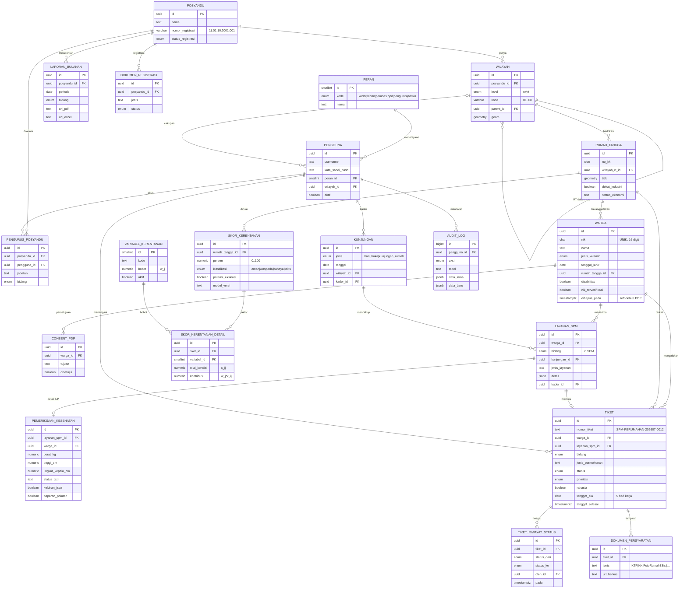

# ERD — Basis Data 6SPM (Posyandu 6 SPM Terintegrasi)

Diagram Entity-Relationship untuk skema pada [`schema_6spm.sql`](schema_6spm.sql), diturunkan dari **PRD_Posyandu_6SPM_FINAL.md** (Bagian 8 & 12). Target: **PostgreSQL 15+ / PostGIS 3+**.

> Diagram Mermaid di bawah tampil otomatis di GitHub, VS Code (ekstensi Mermaid), dan Obsidian. Notasi: `PK` = primary key, `FK` = foreign key.

## 1. Diagram ER

## 2. Kamus Entitas (ringkas)

| #   | Entitas                  | Peran dalam sistem                         | Requirement PRD  |
| :-- | :----------------------- | :----------------------------------------- | :--------------- |
| 1   | `peran`                  | Master 6 peran RBAC                        | Bagian 5         |
| 2   | `posyandu`               | LKD + nomor registrasi kelembagaan         | FR-16            |
| 3   | `wilayah`                | Hierarki RW→RT + batas area (PostGIS)      | FR-13            |
| 4   | `pengguna`               | Akun & scope wilayah                       | Bagian 5, NFR-03 |
| 5   | `pengurus_posyandu`      | Ketua/Sekretaris/Bendahara/6 Ketua Bidang  | Bagian 5         |
| 6   | `rumah_tangga`           | Unit agregasi skor kerentanan + titik peta | FR-13/14         |
| 7   | `warga`                  | Single Identity Index (NIK)                | FR-01            |
| 8   | `consent_pdp`            | Persetujuan pemrosesan data                | FR-21, UU PDP    |
| 9   | `kunjungan`              | Event Hari Buka / door-to-door             | Bagian 6         |
| 10  | `layanan_spm`            | Register 6 SPM (base + JSONB dinamis)      | FR-04            |
| 11  | `pemeriksaan_kesehatan`  | Antropometri, KMS, skrining K3/PTM         | FR-05            |
| 12  | `tiket`                  | Permohonan + status alur + SLA             | FR-07/08/09      |
| 13  | `tiket_riwayat_status`   | Jejak transisi utk SLA & eskalasi          | FR-10            |
| 14  | `dokumen_persyaratan`    | Unggah berkas per bidang                   | Bagian 6         |
| 15  | `variabel_kerentanan`    | Bobot model rule-based (transparan)        | FR-14            |
| 16  | `skor_kerentanan`        | Skor & klasifikasi per rumah tangga        | FR-14            |
| 17  | `skor_kerentanan_detail` | Faktor pembentuk ("alasan")                | FR-14            |
| 18  | `laporan_bulanan`        | Ekspor PDF/Excel format baku               | FR-17            |
| 19  | `dokumen_registrasi`     | Berkas SK & matriks registrasi             | FR-16            |
| 20  | `audit_log`              | Jejak audit create/update/delete/export    | FR-20            |
| 21  | `hari_libur`             | Kalender utk hitung "5 hari kerja" akurat  | FR-09            |

## 3. Keputusan Desain Penting

1. **Register vs Workflow dipisah.** `layanan_spm` mencatat _semua_ layanan (termasuk Kesehatan/ILP yang tidak selalu bertiket); `tiket` hanya dibuat untuk permohonan/rujukan yang butuh alur & SLA. Satu `layanan_spm` dapat memicu paling banyak satu `tiket`.
2. **Field dinamis via JSONB.** Bidang non-kesehatan (Pendidikan, PU, Perumahan, Trantibumlinmas, Sosial) sangat bervariasi → disimpan di `layanan_spm.detail` (JSONB) agar formulir dinamis tanpa migrasi tabel. Data kesehatan yang terstruktur & sering diquery (antropometri) dipisah ke tabel sendiri untuk grafik KMS & agregasi.
3. **SLA "5 hari kerja".** `tenggat_sla` disimpan sebagai `date` yang dihitung aplikasi memakai `hari_libur` (PostgreSQL murni sulit menghitung hari kerja). `v_tiket_sla` menandai `lewat_sla` & `perlu_eskalasi` (>3 hari tanpa perubahan status).
4. **Transparansi penilaian risiko.** Model rilis awal _rule-based_; `skor_kerentanan_detail` menyimpan `x_ij` dan kontribusi `w_j·x_ij` per variabel → skor bisa diaudit (bukan kotak hitam), sesuai FR-14. `potensi_eksklusi` = _rekomendasi tinjau_, bukan keputusan otomatis (FR-15).
5. **Kepatuhan UU PDP.** PK UUID (tak mudah dienumerasi di URL — NFR-05), soft-delete pada `warga` (`dihapus_pada`), `consent_pdp`, dan `audit_log` menyeluruh; `kata_sandi_hash` (bukan plaintext).
6. **Pemetaan spasial.** PostGIS: `rumah_tangga.titik` (Point) untuk heatmap, `wilayah.geom` (MultiPolygon) untuk batas RW/RT; indeks GIST.

## 4. Catatan / Perlu Validasi

- **Bobot `variabel_kerentanan`** pada seed bersifat ilustratif — wajib ditetapkan bersama Pemdes/Puskesmas.
- **Verifikasi NIK** (`nik_terverifikasi`) manual hingga jalur resmi Dukcapil tersedia (PRD Non-Goal NG4).
- **Multi-tenant.** Skema mengakomodasi banyak `posyandu` (siap replikasi ke 18 desa pilot), namun rilis awal fokus 1 lokus (Lemahduwur).
- Format `nomor_tiket` & pemetaan `opd_tujuan` per bidang perlu difinalkan pada Fase 0 Discovery.
