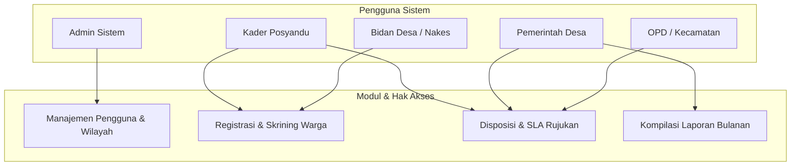
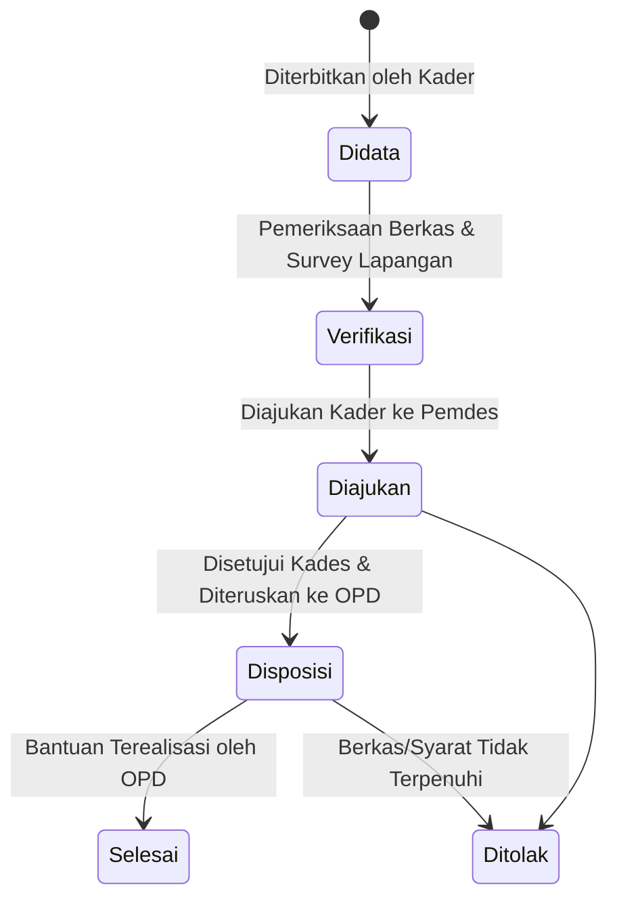

# Buku Panduan Operasional & Manual Pengguna
## Aplikasi Tata Kelola LKD Posyandu 6 SPM (Desa Lemahduwur)

Selamat datang di Buku Panduan Resmi **Aplikasi 6SPM**. Dokumen ini dirancang untuk memandu seluruh pengguna—mulai dari Kader Posyandu, Bidan Desa, Pemerintah Desa, OPD Teknis, hingga Administrator Sistem—dalam menggunakan fitur-fitur aplikasi untuk mendigitalisasi administrasi, mengelola alur rujukan 6 SPM, dan memantau status kerentanan warga secara real-time.

---

## 1. Pendahuluan & Konteks Regulasi

Melalui **Permendagri No. 13 Tahun 2024**, Posyandu secara resmi bertransformasi menjadi **Lembaga Kemasyarakatan Desa (LKD)**. Posyandu kini tidak hanya mengurus kesehatan ibu dan anak, melainkan mengemban mandat dalam menyelenggarakan **6 Standar Pelayanan Minimal (6 SPM)**:

| Bidang SPM | Cakupan Pelayanan LKD Posyandu |
| :--- | :--- |
| **Kesehatan** | Imunisasi, pengukuran tumbuh kembang anak, skrining Penyakit Tidak Menular (PTM) lansia, penyuluhan kesehatan. |
| **Pendidikan** | Akses PAUD, pengelolaan taman bacaan/perpustakaan desa, penguatan literasi digital. |
| **Pekerjaan Umum** | Pemantauan akses air bersih layak, pengelolaan sanitasi/jamban sehat, pelaporan drainase/infrastruktur jalan. |
| **Perumahan Rakyat** | Identifikasi Rumah Tidak Layak Huni (RTLH) dan kampanye lingkungan bersih-sehat. |
| **Trantibumlinmas** | Kesiapsiagaan bencana, deteksi dini gangguan ketertiban umum, dan pelaporan kasus sosial (KDRT, bencana). |
| **Sosial** | Identifikasi dan pendataan fakir miskin untuk usulan Bantuan Sosial (DTKS/PKH/PBI). |

---

## 2. Aktor Sistem & Hak Akses (RBAC)

Aplikasi 6SPM menggunakan sistem **Role-Based Access Control (RBAC)** untuk menjaga privasi data warga sesuai dengan **UU No. 27 Tahun 2022 tentang Pelindungan Data Pribadi (UU PDP)**.



### Panduan Hak Akses Peran:
- **Admin Sistem**: Memegang hak akses penuh untuk mengelola pengguna, wilayah RT/RW, dan audit log keamanan.
- **Kader Posyandu**: Melakukan pencatatan data warga, menginput log layanan 6 SPM, menerbitkan tiket rujukan, serta melakukan kunjungan rumah.
- **Pemerintah Desa (Kades/Sekdes)**: Memverifikasi tiket rujukan yang diajukan kader, mendisposisikan ke OPD terkait, serta mengunduh kompilasi laporan bulanan.
- **Bidan Desa / Nakes**: Melakukan verifikasi klinis kesehatan (ILP), memantau status gizi, dan merujuk secara medis ke Puskesmas.
- **OPD Teknis / Kecamatan**: Menerima pengajuan rujukan fisik dari desa dan memperbarui status tindak lanjut (misalnya: realisasi bedah rumah atau penerbitan bansos).

---

## 3. Fitur Utama & Cara Penggunaan

### 3.1 Manajemen Pengguna & Tautan Akun
Fitur ini diakses oleh **Admin Sistem** untuk mendaftarkan akun pengguna baru dan menautkan profil mereka dengan peran masing-masing.
- **Langkah-langkah**:
  1. Masuk ke menu **Kelola Pengguna** di dashboard admin.
  2. Klik tombol **Tambah Pengguna Baru**.
  3. Masukkan Email, Nama Lengkap, Username, Peran, serta lingkup wilayahnya (Posyandu & RW).
  4. Pengguna baru otomatis dibuatkan akun dengan kata sandi default `password123` (wajib diubah setelah login pertama).

### 3.2 Kelola Pengurus LKD
Sesuai Permendagri 13/2024, susunan pengurus LKD ditetapkan dengan Keputusan Kepala Desa. Menu **Kelola Pengurus** digunakan untuk mendata kepengurusan tersebut.
- **Langkah-langkah**:
  1. Navigasi ke menu **Kelola Pengurus LKD**.
  2. Klik **Tambah Pengurus**.
  3. Pilih Posyandu yang diampu, pilih Jabatan (Ketua, Sekretaris, Bendahara, 6 Ketua Bidang, atau pilih *Anggota/Teks Bebas* untuk menginput jabatan kustom).
  4. Isi Nama Lengkap, Nomor SK Pengurus, dan Status Keaktifan.
  5. Jika pengurus memiliki akun login aplikasi, pilih nama akunnya pada dropdown **Tautkan Akun Aplikasi** untuk sinkronisasi otomatis.

### 3.3 Pencarian Berbasis NIK & Registrasi Warga
Aplikasi 6SPM menggunakan **Single Identity Index** berbasis NIK untuk menghindari pendataan ganda.
- **Langkah-langkah**:
  1. Pada halaman utama (dasbor kader), gunakan kolom pencarian untuk mengetik 16-digit NIK warga atau memindai barcode KTP/KIA menggunakan kamera.
  2. Jika data warga ditemukan, sistem akan menampilkan rekomendasi formulir SPM berdasarkan profil usia (misal: Balita akan diarahkan ke form Imunisasi/KMS).
  3. Jika NIK tidak ditemukan, klik **Registrasi Warga Baru**, lalu lengkapi Nama, Jenis Kelamin, Tanggal Lahir, Alamat, Hubungan Keluarga, dan RT/RW domisili.

> [!IMPORTANT]
> Pastikan NIK yang dimasukkan persis 16 digit. Sistem memiliki validasi regex bawaan untuk mencegah salah ketik.

---

### 3.4 Pencatatan Log Layanan 6 SPM
Setiap pelayanan atau pemeriksaan yang diberikan kepada warga dicatat melalui menu **Catat Layanan**.

```carousel
```python
# Contoh detail JSONB untuk bidang Pekerjaan Umum (Air Bersih)
{
  "sumber_air": "PAM / Sumur Terlindung",
  "akses_layak": true,
  "volume_harian_liter": 60
}
```
<!-- slide -->
```python
# Contoh detail JSONB untuk bidang Perumahan Rakyat (RTLH)
{
  "kondisi_atap": "bocor",
  "kondisi_dinding": "non-permanen",
  "status_kepemilikan": "milik_sendiri"
}
```
```

#### Langkah-langkah pencatatan:
1. Cari warga menggunakan NIK, lalu buka profilnya.
2. Klik tombol **Catat Layanan**.
3. Pilih **Bidang SPM** yang dilayani (Pendidikan, Kesehatan, Pekerjaan Umum, Perumahan Rakyat, Trantibumlinmas, atau Sosial).
4. Pilih **Jenis Layanan** dan masukkan tanggal serta catatan pelayanannya.
5. Masukkan data spesifik bidang (misal: berat badan & tinggi badan untuk Kesehatan, atau detail sumber air bersih untuk Pekerjaan Umum).
6. Klik **Simpan**. Data akan langsung tercatat di Riwayat Log Layanan Warga tersebut.

---

### 3.5 Alur Tiket Rujukan & SLA 5 Hari Kerja
Ketika kader mengidentifikasi warga yang membutuhkan bantuan/rujukan non-medis yang berada di luar kewenangan posyandu (misalnya: usulan bedah rumah atau bansos), kader akan menerbitkan **Tiket Rujukan**.

#### Alur Kerja Tiket:



- **SLA 5 Hari Kerja**: Sistem secara otomatis menghitung batas waktu penyelesaian tiket sejak status masuk ke *Diajukan*. Akhir pekan dan hari libur nasional dikecualikan secara otomatis dari perhitungan.
- **Red Flag (Eskalasi Otomatis)**: Jika tiket mengendap pada status tertentu **lebih dari 3 hari kerja**, sistem akan memberi penanda warna merah (*red flag*) pada dashboard Kepala Desa serta mengirim notifikasi pengingat otomatis agar segera ditindaklanjuti.

---

### 3.6 Dasbor Heatmap & Prioritas Kunjungan Rumah
Untuk membantu kader melakukan kunjungan rumah secara efektif, sistem dilengkapi dengan dasbor spasial sederhana berbasis koordinat geolokasi.
- **Rule-Based Vulnerability Scoring**: Sistem menghitung skor kerentanan rumah tangga secara transparan (0-100%) berdasarkan variabel berbobot:
  - Adanya lansia tunggal (+25%)
  - Berada di radius industri/peleburan logam (+20%)
  - Balita terindikasi stunting (+20%)
  - Kondisi ekonomi di bawah Desil 3 (+20%)
  - Kepadatan hunian/ventilasi buruk (+15%)
- **Deteksi Potensi Exclusion**: Warga dengan skor kerentanan tinggi yang belum terdaftar menerima bantuan sosial (Bansos/RTLH) akan otomatis ditandai dengan label kuning di dashboard kader sebagai rekomendasi prioritas kunjungan rumah berikutnya.

---

## 4. Pelaporan & Output

Laporan bulanan dapat dihasilkan secara instan tanpa perlu rekapitulasi manual di kertas.
1. Masuk ke menu **Laporan**.
2. Pilih Periode Laporan (Bulan dan Tahun).
3. Klik **Ekspor Laporan**.
4. Pilih format output:
   - **PDF**: Menghasilkan dokumen format resmi yang siap ditandatangani Kepala Desa dan diserahkan ke Kecamatan.
   - **Excel (.xlsx)**: Membuka data tabel terstruktur untuk keperluan audit internal maupun pengolahan data lanjutan.

---

## 5. Pertanyaan Umum (FAQ) & Pemecahan Masalah

> [!NOTE]
> **Tanya: Mengapa input Jabatan Kustom tertutup sendiri saat saya mengetik?**
>
> *Jawab: Bug ini telah diperbaiki secara permanen. Anda sekarang dapat memilih opsi "Anggota / Teks Bebas" pada dropdown jabatan, dan mengetik detail jabatan baru secara langsung tanpa khawatir kolom input menghilang.*

> [!WARNING]
> **Tanya: Mengapa muncul pesan error "violate not-null constraint" saat menjalankan log layanan baru?**
>
> *Jawab: Hal ini terjadi jika Anda mencoba memasukkan data layanan untuk warga yang belum terdaftar. Pastikan data warga tersebut telah terdaftar terlebih dahulu di menu "Kelola Warga" sebelum Anda mencatatkan riwayat log SPM miliknya.*

> [!TIP]
> **Tanya: Apakah aplikasi ini dapat digunakan tanpa koneksi internet (Offline)?**
>
> *Jawab: Ya, aplikasi ini berjalan menggunakan arsitektur Progressive Web App (PWA). Anda dapat mendata warga dan menginput log layanan di lapangan tanpa sinyal. Data akan tersimpan aman di penyimpanan lokal HP Anda dan disinkronkan otomatis ketika Anda mendapatkan koneksi internet kembali.*
